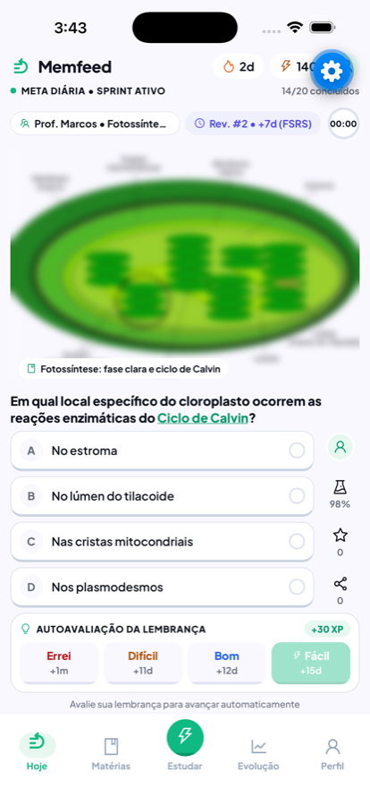
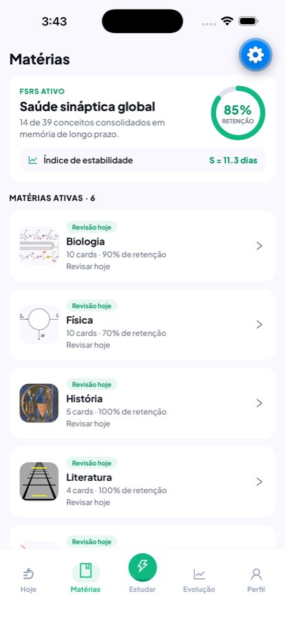
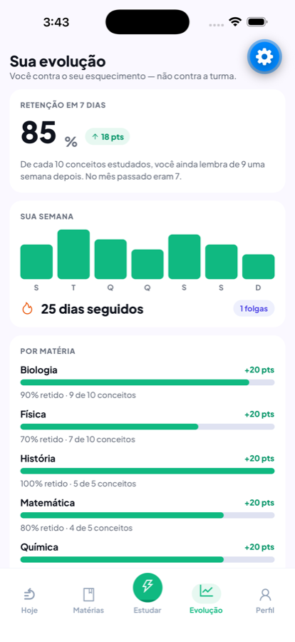
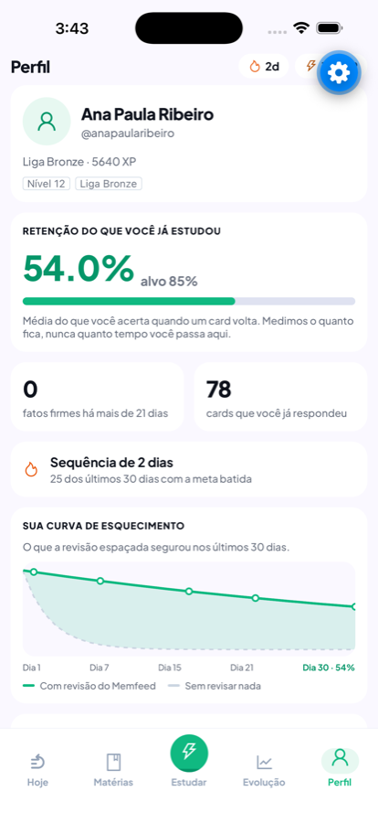

<div align="center">


# Memfeed

**A interface do TikTok, o algoritmo do Ebbinghaus.**

O feed que devolve atenção em vez de tomar. Cada card é uma pergunta de 15 segundos sobre o
que você acabou de estudar, agendada para voltar no dia em que a sua memória ia falhar —
dentro de uma sessão que **acaba de propósito**.


[](https://memfeed-app.netlify.app)
[](https://memfeed-web.netlify.app)

**[Abrir o app no navegador](https://memfeed-app.netlify.app)** · **[Landing e painel do professor](https://memfeed-web.netlify.app)**

</div>

---

## O problema

A atenção média em uma tela caiu de 2,5 minutos em 2004 para **47 segundos** hoje. A ciência
da aprendizagem, por outro lado, é clara: quem se auto-testa retém **61%** do conteúdo depois
de uma semana, contra **40%** de quem apenas releu.

O aluno de 2026 estuda do jeito que não funciona — print do quadro, PDF que não abre, resumo
pedido à IA na véspera — num celular desenhado para capturar atenção e **eliminar esforço**.
Justamente os dois ingredientes de que a memória precisa.

O Memfeed não tenta tirar o celular da mão dele. Usa o mesmo formato, com a função-objetivo
trocada: em vez de otimizar tempo de tela, otimiza **retenção**.

<br />

## Como funciona

<div align="center">




</div>

<br />

**1. O conteúdo tem duas origens, e nenhuma é a câmera.** O professor termina a aula, abre o
painel, digita o assunto, revisa uma vez e publica para a turma. Ou o aluno escolhe o que quer
treinar e o **Gemini** gera para ele — LLM integrado de verdade, via `memfeed-api`, com a
saída validada por schema antes de virar card. Cada card mostra de onde veio:

```
Prof. Marcos • Respiração celular        ← a turma inteira recebeu
Você escolheu • Entropia                 ← ele pediu
```

**2. As duas caem na mesma fila.** O que foi respondido na aula de terça volta no dia 1, 3, 7
e 16, misturado com o que o aluno pediu. É isso que faz ser um app só, e não dois.

**3. Ele se auto-avalia.** Depois de responder, escolhe entre **Errei · Difícil · Bom ·
Fácil**. O [FSRS](https://github.com/open-spaced-repetition/ts-fsrs) calcula quando o card
volta, e o intervalo aparece na tela: `+1m`, `+12d`, `+15d`, `+20d`.

**4. A sessão acaba.** Batida a meta diária, acabou. Sem scroll infinito, sem "mais um card",
sem notificação fora da janela que ele escolheu.

<br />

## Três invariantes que nenhum código quebra

**A IA gera pergunta, nunca resposta pronta.** O esforço de recuperação é do aluno. Isso vale
até para a figura: diagrama de acervo vem rotulado, e o rótulo costuma nomear a resposta — por
isso a imagem entra levemente borrada e só abre depois que o aluno se compromete com uma
alternativa.

**A sessão tem fim.** Quem monetiza tempo de tela não pode encerrar a sessão. Nós podemos.

**Não existe ranking entre alunos.** Placar que ordena adolescentes por desempenho expõe
publicamente quem vai mal. O aluno compete contra o próprio esquecimento, na aba **Evolução**;
o professor vê a turma no agregado, nunca o aluno.

<br />

## Rodando local

Pré-requisitos: Node 22+ e, para o aparelho físico, o [Expo Go](https://expo.dev/go).

```bash
npm install
npm run web          # abre no navegador
npm run ios          # simulador iOS · npm run android para o emulador
npm start            # QR code para abrir no Expo Go do seu celular
```

O app fala com a [`memfeed-api`](https://github.com/emersonjds/memfeed-api). Crie um `.env`:

```bash
EXPO_PUBLIC_USE_MOCKS=false
EXPO_PUBLIC_API_URL=http://192.168.0.10:3000    # o IP da sua máquina na rede, não localhost
EXPO_PUBLIC_STUDENT_ID=11111111-1111-4111-8111-111111111111
```

No celular, `localhost` aponta para o próprio aparelho — por isso o IP da máquina. No
`npm run web`, `http://localhost:3000` funciona normalmente.

Com `EXPO_PUBLIC_USE_MOCKS=true` o app resolve tudo por `src/shared/api/mocks/routes.ts`, com
latência simulada e o mesmo contrato — útil para mexer em tela sem subir o backend.

<br />

## Arquitetura

**Feature-Sliced Design**, import só descendo: `app → widgets → features → entities → shared`.

```
app/                    rotas do expo-router — Hoje · Matérias · Estudar · Evolução · Perfil
src/
  widgets/              feed-list · question-card · profile
  features/             answer-card · daily-session
  entities/             card · review · session · progress · study · teacher · notebook
  shared/               api · theme · ui
```

**Zod na fronteira de confiança, sempre.** Toda resposta da API passa por `parse` antes de
virar estado — divergência de contrato quebra em desenvolvimento, não na frente do usuário.

### A restrição que governa as outras

O app **precisa rodar no Expo Go** e **exportar para web**: são os dois caminhos de teste sem
instalação. Dependência que exige módulo nativo customizado está fora — `react-native-mmkv` e
`react-native-skia` quebram o Expo Go.

<br />

## Design system

Fundo branco, sombra sólida sem blur no estilo Duolingo (`borderBottomWidth: 4`), raio `999`
em pílula e `16`/`20` em card. Tokens em `src/shared/theme/`:

| | | |
| --- | --- | --- |
| `primary` | `#10b981` | ação, acerto, progresso |
| `primaryDeep` | `#059669` | sombra sólida, estado pressionado |
| `surface` / `surfaceSoft` | `#ffffff` / `#faf8ff` | tela e agrupamento |
| `text` / `textMuted` | `#0f131d` / `#131b2e` | título e apoio |
| `accent` | `#4f46e5` | dado secundário |

Cor literal em `StyleSheet` de tela é bug.

<br />

## Verificação

```bash
npm run typecheck && npm run lint && npm test
```

<br />

## Repositórios

| | |
| --- | --- |
| [`memfeed-api`](https://github.com/emersonjds/memfeed-api) | Fastify / PostgreSQL — FSRS, geração por IA e o relatório da turma |
| [`memfeed-web`](https://github.com/emersonjds/memfeed-web) | Next.js — landing pública e painel do professor |

O contrato entre os três é o **OpenAPI da API**, nunca um import compartilhado.

<br />

## Licença

MIT.
