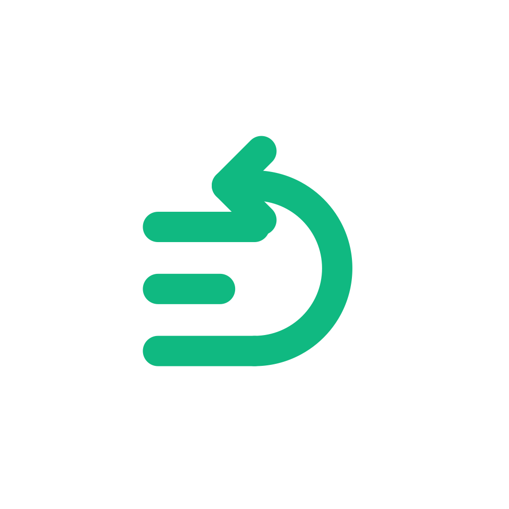
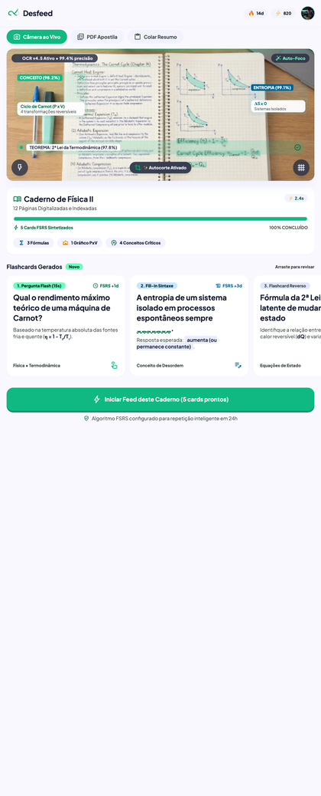
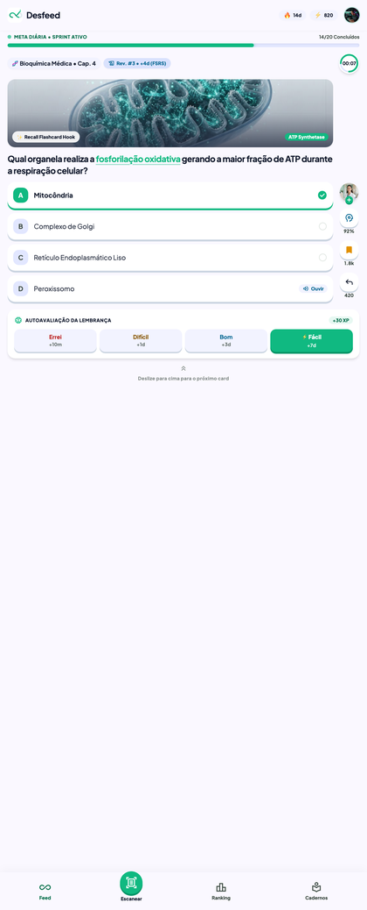
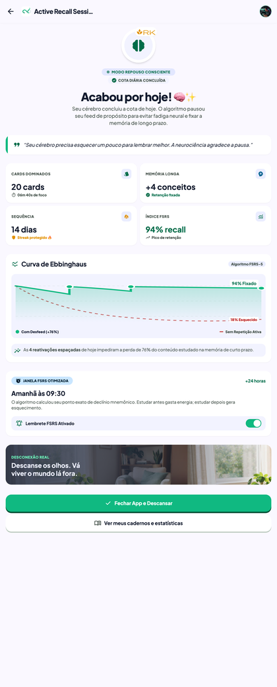
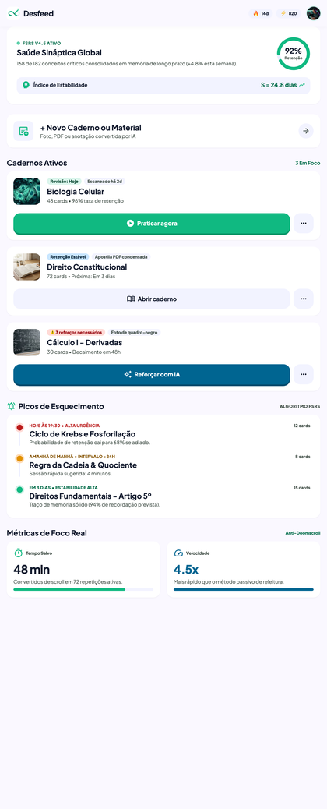

<div align="center">



# Memfeed

**O feed que devolve em vez de tomar.**

Um app de estudo com a interface que o aluno já sabe usar — rolagem vertical, um card por
tela, streak — só que apontada para o lado certo: cada card é uma pergunta sobre o que ele
mesmo estudou, e a sessão acaba de propósito.

<br />


<br />

**[▶ Abrir a demo](https://memfeed-app.expo.app)** — roda no navegador do celular, sem instalar nada.

</div>

<br />

## Testar sem instalar

| Caminho | Como | Para quem |
|---|---|---|
| **Navegador** | [memfeed-app.expo.app](https://memfeed-app.expo.app) | Qualquer pessoa. Abre e usa. |
| **Expo Go** | `npx expo start` e aponte a câmera no QR code | Quem quer o app nativo, com háptico e gesto de verdade |

A demo responde pelas rotas mockadas, com o mesmo contrato que a API vai expor. O háptico e
a paginação por gesto só existem no caminho nativo — o navegador não os tem.

<br />

## O problema

A atenção média em uma tela caiu de 2,5 minutos em 2004 para **47 segundos** hoje. Ao mesmo
tempo, a ciência da aprendizagem é bem clara sobre o que funciona: quem se auto-testa retém
**61%** do conteúdo depois de uma semana, contra **40%** de quem apenas releu o material.

O aluno de 2026 estuda do jeito que não funciona — print do quadro, PDF que não abre, resumo
pedido à IA na véspera da prova — usando um celular desenhado para capturar atenção e
eliminar esforço. Justamente os dois ingredientes que a memória precisa.

O Memfeed não tenta tirar o celular da mão dele. Usa o mesmo formato, com a função-objetivo
trocada: em vez de otimizar tempo de tela, otimiza retenção.

<br />

## Como funciona

<div align="center">




</div>

<br />

**1. O conteúdo vem do caderno dele.** O aluno fotografa a página escrita à mão. A IA lê e
escreve as perguntas — nunca as respostas. O esforço de recuperação continua sendo dele.

**2. O feed devolve.** Rolagem vertical, um card por tela, o gesto que ele já domina. Cada
card é resolvível em cerca de 15 segundos — precisa caber no orçamento de atenção que existe
de verdade.

**3. Ele se auto-avalia.** Depois de responder, escolhe entre **Errei · Difícil · Bom ·
Fácil**. O [FSRS](https://github.com/open-spaced-repetition/ts-fsrs) calcula quando aquele
card volta, e o intervalo aparece na tela: `+10min`, `+1d`, `+3d`, `+7d`.

**4. A sessão acaba.** Batida a meta diária, acabou. Sem scroll infinito, sem "mais um card",
sem notificação fora da janela que ele escolheu.

<br />

## Três decisões que definem o produto

Não são preferências de interface — são restrições de arquitetura, e cada uma tem teste que
falha se for quebrada.

| | |
|---|---|
| **A IA gera pergunta, nunca resposta** | Um produto de estudo que entrega a resposta pronta elimina exatamente o esforço que produz memória |
| **A sessão tem fim** | Nenhum caminho da interface repopula a fila no mesmo dia. É a diferença entre mecânica de hábito e mecânica de captura |
| **O agendamento é visível** | O aluno vê `+3d` na tela. Ele entende o método, não só obedece a ele |

<br />

## Stack

| Camada | Escolha | Por quê |
|---|---|---|
| Runtime | **Expo SDK 57** · React Native 0.86 | Distribuição: QR code no Expo Go, APK por link, atualização OTA |
| Navegação | **expo-router** | Roteamento por arquivo, deep link nativo |
| Interface | **Ant Design Mobile 5.4.3** | Componente nativo pronto e acessível; `antd-mobile` ficou fora por ser React DOM |
| Dados remotos | **TanStack Query** | Cache, revalidação e estados de carregamento sem boilerplate |
| Estado local | **Zustand** | A sessão do dia e a fila de cards |
| Validação | **Zod** | Um schema por entidade, servindo de tipo e de parser |
| Repetição espaçada | **ts-fsrs 5.4.2** | Implementação de referência do FSRS, em TypeScript puro |
| Mock de API | **Rotas em `mocks/routes.ts`** | Mesma resposta no celular e na web, com latência simulada |
| Testes | **node:test** | Runner nativo, sem framework a manter |

### A restrição que governa as outras

O app roda no **Expo Go**. É assim que ele chega em quem vai testar: um QR code, sem
instalação, sem cadastro, sem Xcode. Isso significa que nenhuma dependência com módulo
nativo customizado entra — `react-native-mmkv` e `react-native-skia` estão fora.

Foi por distribuição que a escolha foi Expo em vez de React Native puro. Abrir mão disso
anularia a decisão.

<br />

## Arquitetura

**Feature-Sliced Design**, com a regra de dependência valendo em uma direção só:

```
app  →  widgets  →  features  →  entities  →  shared
```

Cada camada importa apenas das que estão à sua direita. Tela não importa de tela. Quando uma
feature precisa de algo de outra, o problema é o desenho — a peça comum sobe para `entities`
ou `shared`.

| Camada | Responsabilidade | Exemplo |
|---|---|---|
| `app/` | Rotas do expo-router. Só composição, zero regra de negócio | `app/(tabs)/feed.tsx` |
| `widgets/` | Blocos de tela compostos | `QuestionCard`, `FeedList` |
| `features/` | Uma interação com estado próprio | `answer-card`, `daily-session` |
| `entities/` | Modelo do domínio e schema Zod — a fonte da verdade do tipo | `card`, `review`, `session` |
| `shared/` | Primitivos de UI, cliente de API, utilidades | `Button`, `SolidShadow` |

**Um tipo é a fonte da verdade.** Os schemas Zod em `entities/*/schema.ts` são usados pelo
mock, pelo cliente de API e pelos componentes. `z.infer<>` deriva o tipo; ninguém redigita.

**Parse na borda.** Dado externo vira tipo interno num ponto só — `shared/api/client.ts` — e
o resto do sistema confia.

<br />

## Estrutura de pastas

```
memfeed-app/
├── app/                          rotas do expo-router
│   ├── _layout.tsx               layout raiz, providers
│   ├── sessao-concluida.tsx      tela de fim de sessão
│   └── (tabs)/
│       ├── _layout.tsx           tab bar
│       ├── index.tsx             redireciona para o feed
│       ├── feed.tsx              feed de microrecuperação
│       ├── escanear.tsx          scanner de caderno
│       ├── ranking.tsx           ligas
│       └── cadernos.tsx          cadernos e retenção
│
├── src/
│   ├── shared/
│   │   ├── ui/                   Button · Badge · Pill · GoalBar · CircularTimer
│   │   │   └── SolidShadow.tsx   a sombra sólida sem blur, resolvida uma vez
│   │   └── api/
│   │       ├── client.ts         fetch tipado com parse Zod na resposta
│   │       ├── config.ts         base URL por ambiente
│   │       ├── query-client.ts   configuração do TanStack Query
│   │       └── mocks/            rotas mockadas — caminho feliz, erro e vazio
│   │
│   ├── entities/
│   │   ├── card/                 schema, queries e o mapeamento para o FSRS
│   │   ├── review/               schema e envio da revisão
│   │   ├── session/              schema e progresso do dia
│   │   └── notebook/             schema e ingestão da foto
│   │
│   ├── features/
│   │   ├── answer-card/          responder e auto-avaliar
│   │   ├── daily-session/        meta, fila e o fim da sessão
│   │   └── scan-notebook/        captura e processamento
│   │
│   └── widgets/
│       ├── question-card/        o card completo do feed
│       └── feed-list/            a lista paginada
│
├── assets/                       ícones e splash
├── docs/                         design, decisões e pesquisa
├── app.json                      configuração do Expo
├── tailwind.config.js            tokens do design system
└── tsconfig.json                 TypeScript estrito
```

<br />

## Design system

Os tokens vivem em `tailwind.config.js` e são a única fonte de cor no projeto.

| Token | Valor | Uso |
|---|---|---|
| `primary` | `#10b981` | Ação, acerto, progresso |
| `primary-deep` | `#059669` | Sombra sólida, estado pressionado |
| `surface` | `#ffffff` | Fundo de tela e de card |
| `surface-soft` | `#faf8ff` | Agrupamentos e seções |
| `border` | `#cbd5e1` | Divisores e sombra neutra |
| `text` | `#0f131d` | Títulos e corpo |
| `accent` | `#4f46e5` | Dado secundário |

A assinatura visual é a **sombra sólida sem blur** — o volume de botão físico, no estilo
Duolingo. React Native não tem `box-shadow` com offset e zero blur, então ela é um primitivo
próprio (`shared/ui/SolidShadow.tsx`) que os demais componentes compõem. Nenhuma tela
reimplementa.

Alvo de toque mínimo de 44px, contraste de no mínimo 4,5:1 em todo texto, e layout pensado a
partir de 375px.

<br />

## Começando

### Pré-requisitos

- **Node.js 20+**
- **Expo Go** no celular — [iOS](https://apps.apple.com/app/expo-go/id982107779) ·
  [Android](https://play.google.com/store/apps/details?id=host.exp.exponent)

Não é preciso Xcode nem Android Studio para rodar no aparelho.

### Instalação

```bash
git clone https://github.com/emersonjds/memfeed.git
cd memfeed
npm install
npm start
```

O terminal mostra um **QR code**. Aponte a câmera (iOS) ou abra o Expo Go (Android) — o app
carrega em segundos. Celular e computador precisam estar na mesma rede.

Em rede corporativa ou Wi-Fi que isola dispositivos, use o túnel:

```bash
npx expo start --tunnel
```

### Sem backend

Não há nada para subir. O cliente HTTP resolve pelas rotas de `src/shared/api/mocks/routes.ts`,
com o mesmo contrato que a API vai expor e latência simulada — incluindo os caminhos de erro e
de lista vazia.

Para publicar a demo web, a flag é obrigatória: `__DEV__` é falso em produção e sem ela toda
tela cai no estado de erro.

```bash
EXPO_PUBLIC_USE_MOCKS=true npx expo export -p web --output-dir dist
npx eas-cli deploy --prod
```

<br />

## Scripts

| Comando | O que faz |
|---|---|
| `npm start` | Servidor de desenvolvimento com QR code |
| `npm run ios` | Abre no simulador iOS |
| `npm run android` | Abre no emulador Android |
| `npm run web` | Abre no navegador |
| `npm run typecheck` | `tsc --noEmit` |
| `npm test` | Suíte de testes |

### Gerando um APK para testar em outro aparelho

```bash
npm install -g eas-cli
eas login
eas build -p android --profile preview
```

O build sai como link de download. Para corrigir algo sem pedir reinstalação:

```bash
eas update
```

### Quando não sobe

```bash
npx expo start -c                    # limpa o cache do Metro
rm -rf node_modules && npm install   # reinstala do zero
```

Se o Expo pedir um *development build*, alguma dependência saiu do conjunto que o Expo Go
suporta. Confira o que foi instalado por último.

<br />

## Fluxo de trabalho

```
master        versão estável
  └── developer        integração
        └── feature/spa-NNN-descricao
```

Uma branch por demanda, criada a partir de `developer` atualizada. Implementa, verifica,
mescla em `developer`, apaga a branch — e só então começa a próxima.

Commits seguem [Conventional Commits](https://www.conventionalcommits.org/) em inglês, com a
mensagem descrevendo o propósito, não a lista de arquivos.

Antes de qualquer merge:

```bash
npm run typecheck && npm test
```

<br />

## Licença

[MIT](LICENSE)
